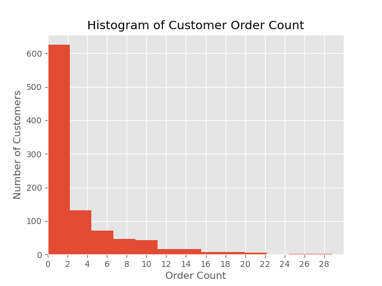
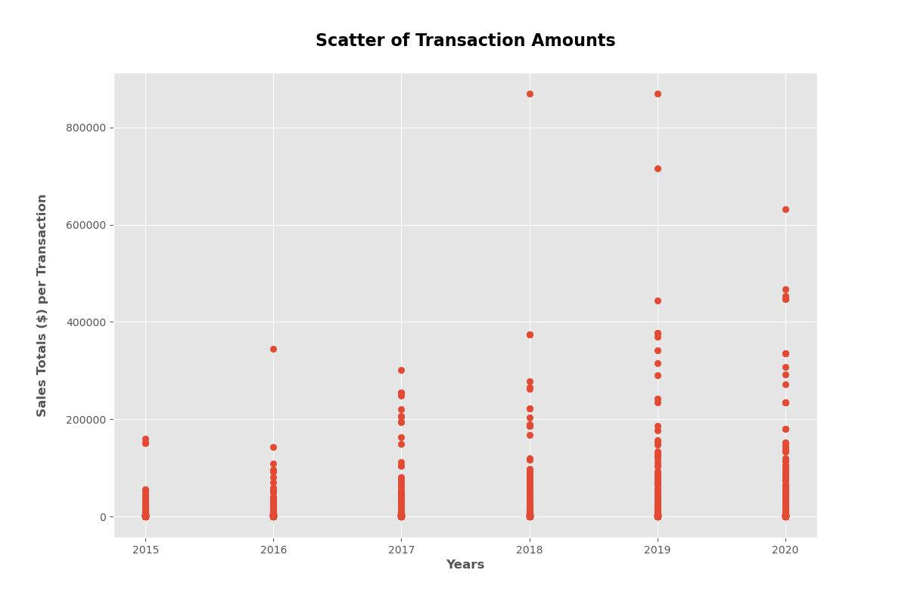
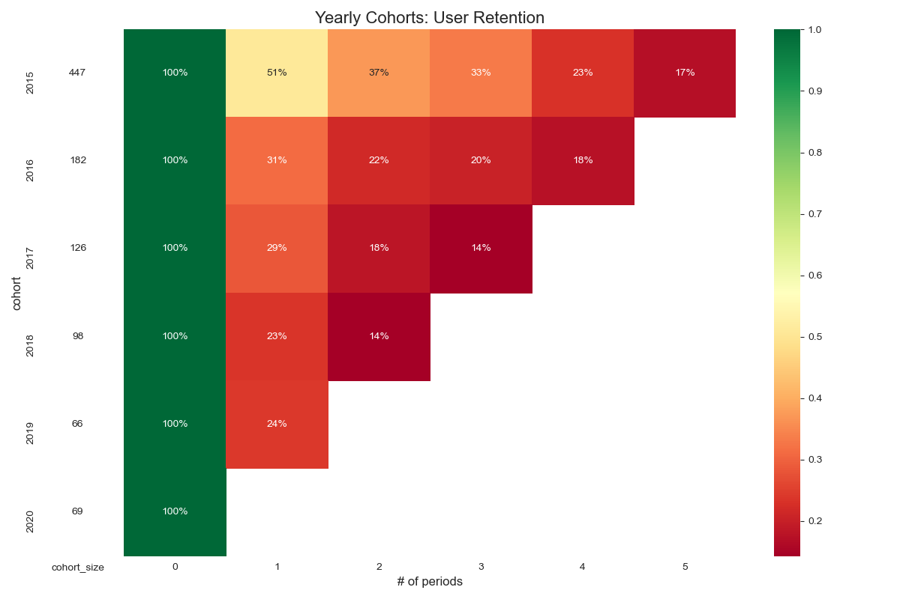

# Using Advanced Customer Analytics to Value a Company

The value of a business is the present value of all future cashflows

put another way, the amount of money the business will make based on the value of money today.

Traditionally, this has been calculated using a frequentist approach by projecting historical revenues, growth and cashflow numbers forward then discounting them for todays value of money.

With data science we can better predict revenues, growth and cashflows by segmenting customers into cohorts and:
* Calculating churn and retention rates for each cohort
* Calculating number of new customers per year
* Calculating average revenue per order
* Calculating average number of transaction per customer  

Then use those values to apply statistical models to predict future revenues and cashflows more accurately.

 

 

 