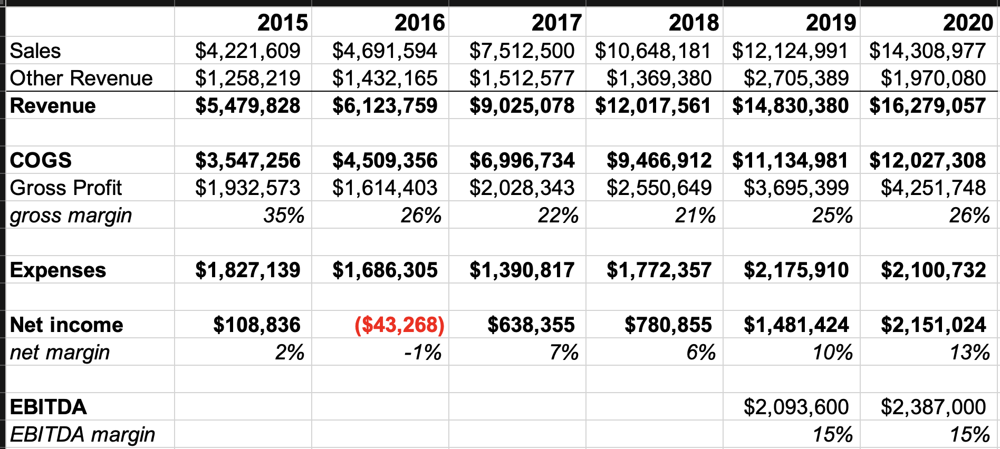

 

  

# Using Advanced Customer Analytics to Value a Company 

Company valuation traditionally has been calculated two ways
1. **Discounted Cash Flow (DCF)** is a frequentist approach to project historical revenues, growth and cashflow numbers forward then discounting them for todays value of money.  

 

 

2. **Market Multiple** approach is similar to pricing a home:
    * Home Price = Total SQFT * $ per SQFT from comparable homes that recently sold or are on the market
    * Company Valuation = EBTIDA * Market Multiple
        * Middle Market Median Deal Multiples - Pepperdine 2020 report:

 

 

With data science we can better predict revenues, growth and cashflows by segmenting customers into cohorts to:
* Model churn and retention rates for each cohort
* Model expected future amount of transactions
* Model expected average sales per transaction
* Model number of new customers per year
* Calculate average profit margin per customer
* Calculate cash flows from customers aka Customer Life Time Values (CLTV)
* Calculate sum of CLTVs by period cohorts to provide Future Cash Flows that can be discounted to todays value
  

# Wrangle Customer Data:

Company: "eChalk" is a supplier and installer of smart school equipment such as "smart boards"  
Dataset: 5 years of customer transaction history

Report example:

 

Company Financials:

 

# Process & Analyze the Data:

nunique customers 990  
repeat customers i.e. more than one purchase  
repeat customer %  
Transactions per year  
avg sales per transaction 5 yrs  
avg sales per transaction 2020  

 

 

# Build & Train Models:
Using the Customer Transactiion Sales data we are able to build a Recency, Frequency, Monetary Value (RFM) dataset
* insert CustID RFM
* pivot of 

# Model Goals 
A) To predict Frequency (Number of Transactions) & Recency (Prob Alive)
B) Predict Monetary Value aka Avg Sales per Transaction
C) A * B = Sales/yr in order to forecast sales

# Hyperparameter base assumptions:
* T = days
* time = year 
* any additional  
* train on 2015-2019
* holdout should be 2020 

 

# Select Training Metric

# Select Model(s)

| Model       | Frequency | Recency | Monetary_Value | Output        |
|-------------|-----------|---------|----------------|---------------|
| BG/NBD      |     X     |         |                | Pred_Txn      |
| BG/NBD      |           |    X    |                | Prob_Alive    |
| Gamma-Gamma |           |         |        X       | Exp_Avg_Sales |
|             |           |         |                |               |

# Train & Evaluate the Model
use Cross Validation Grid Search
train on training data
then evaluate on test data

# HyperParameter Tuning
t = 
t = 
t =
holdout =
holdout =

# Predictions:

 

 

Cohorts | Exp. Avg Value of Sales | Exp. Txn| Retention | LTV | Profit Margin | CLTV | WACC | (PV) CLTV

# CBCV Calculations

# Valuation Comparison

## noted resources
McCarthy papers  
Fader papers  
Hardie notes & papers  
lifetimes package: https://lifetimes.readthedocs.io/en/latest/index.html
Analytics Vidhya CLTV guide: https://www.analyticsvidhya.com/blog/2020/10/a-definitive-guide-for-predicting-customer-lifetime-value-clv/ 
Modelling CLTV for Non-Contractual Business with Python: https://towardsdatascience.com/whats-a-customer-worth-8daf183f8a4f
Cohort Analysis: https://towardsdatascience.com/a-step-by-step-introduction-to-cohort-analysis-in-python-a2cbbd8460ea
https://www.kdnuggets.com/2018/05/general-approaches-machine-learning-process.html